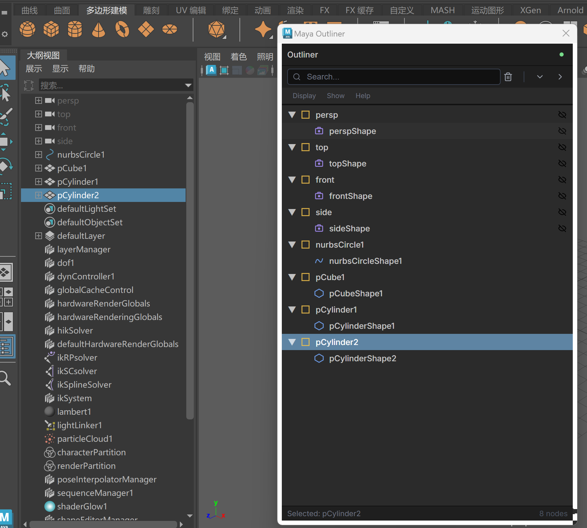

# Maya Outliner - AuroraView 示例

[](https://github.com/loonghao/auroraview-maya-outliner/releases)
[](https://github.com/loonghao/auroraview-maya-outliner/releases)
[](https://vuejs.org/)
[](https://www.typescriptlang.org/)
[](https://vitejs.dev/)
[](../../README_zh.md)

[English Documentation](./README.md) | [📦 安装指南](./INSTALLATION.md) | [快速开始](./QUICKSTART.md) | [部署指南](./DEPLOYMENT.md) | [本地开发](./LOCAL_DEVELOPMENT.md)

使用 **AuroraView**、**Vue 3** 和 **TypeScript** 构建的现代化、基于 Web 的 Maya 大纲视图。此示例演示了如何使用直接嵌入 Maya 的现代 Web 技术创建高性能 DCC 工具。

## ✨ 特性

- 🌳 **层级场景树** - 显示 Maya 场景层级结构，支持节点展开/折叠
- 🎯 **实时选择同步** - Maya 和 UI 之间的双向选择同步
- 👁️ **可见性切换** - 直接从大纲视图显示/隐藏对象
- 🔍 **搜索与过滤** - 按名称快速查找节点
- ⚡ **高性能** - 使用 AuroraView 优化的 IPC 流畅处理 10,000+ 节点
- 🎨 **现代化 UI** - 使用 Vue 3 构建的简洁深色主题界面
- 🔄 **实时更新** - 场景变化时自动更新 UI

## 🖼️ 演示



## 🏗️ 架构

```
┌─────────────────────────────────────────┐
│           Maya (Python)                 │
│  ┌───────────────────────────────────┐  │
│  │   maya_outliner.py                │  │
│  │   - 场景层级查询                   │  │
│  │   - 选择管理                       │  │
│  │   - 可见性控制                     │  │
│  │   - Maya 回调                      │  │
│  └───────────┬───────────────────────┘  │
│              │ AuroraView IPC            │
│              │ (基于线程, <1μs)           │
│  ┌───────────▼───────────────────────┐  │
│  │   WebView (嵌入式)                │  │
│  │  ┌─────────────────────────────┐  │  │
│  │  │  Vue 3 前端                 │  │  │
│  │  │  - OutlinerTree.vue         │  │  │
│  │  │  - TreeNode.vue             │  │  │
│  │  │  - useMayaIPC composable    │  │  │
│  │  └─────────────────────────────┘  │  │
│  └───────────────────────────────────┘  │
└─────────────────────────────────────────┘
```

## 📦 安装

### 快速安装(普通用户)

**下载最新版本并运行安装程序:**

1. 访问 [Releases](https://github.com/loonghao/auroraview-maya-outliner/releases)
2. 下载 `maya-outliner-{version}.zip`
3. 解压并运行 `install.bat` (Windows) 或 `install.sh` (Linux/macOS)
4. 重启 Maya
5. 在 Maya 脚本编辑器中运行:
   ```python
   from auroraview_maya_outliner import main
   main()
   ```

📖 **[完整安装指南](./INSTALLATION.md)** - 所有平台的详细安装说明

### 开发者安装

对于想要贡献或自定义的开发者:

#### 前置要求

- **Maya 2020+** (Python 3.7+)
- **Node.js 18+** 和 npm
- 在 Maya 的 Python 环境中安装 **AuroraView**

#### 安装 AuroraView

```bash
# 在 Maya 的 Python 中使用 pip
mayapy -m pip install auroraview
```

### 安装前端依赖

```bash
cd examples/maya-outliner
npm install
```

## 🚀 使用方法

### 使用 Justfile 快速开始（推荐）

本项目包含 `justfile` 配置文件，可以轻松设置和启动 Maya。

**前置要求：**
- 安装 [just](https://github.com/casey/just) 命令运行器
- 安装 AuroraView：`mayapy -m pip install auroraview`
- 安装前端依赖：`npm install`

**启动带有 AuroraView Outliner 的 Maya：**

```bash
# Maya 2022
just maya-2022

# Maya 2024
just maya-2024

# Maya 2025
just maya-2025
```

这将会：
1. ✅ 复制 `userSetup.py` 到 Maya 脚本文件夹并配置正确路径
2. ✅ 启动 Maya
3. ✅ 在启动时创建带有 "Outliner" 按钮的 "AuroraView" 工具架

**检查你的设置：**
```bash
just info
```

这会显示：
- 项目路径
- Maya 安装状态
- UserSetup 安装状态

**本地开发模式：**

如果你正在本地开发 AuroraView，使用 `-local` 后缀：

```bash
just maya-2024-local  # 使用自定义路径的本地 AuroraView
```

详见 [LOCAL_DEVELOPMENT.md](./LOCAL_DEVELOPMENT.md)。

**其他有用命令：**
```bash
just install          # 安装 npm 依赖
just dev              # 启动 Vite 开发服务器
just build            # 构建生产版本
just clean-maya 2024  # 从 Maya 2024 移除 userSetup.py
just clean-all-maya   # 从所有 Maya 版本移除 userSetup.py
```

📖 查看 [QUICKSTART.md](./QUICKSTART.md) 了解更多详情

### 开发模式（手动方式）

1. **启动 Vite 开发服务器:**

```bash
npm run dev
```

这将在 `http://localhost:5173` 启动开发服务器，支持热重载。

2. **在 Maya 中运行:**

打开 Maya 的脚本编辑器并运行:

```python
from auroraview_maya_outliner import maya_outliner

# 使用开发服务器（默认）
outliner = maya_outliner.main()

# 关闭窗口
outliner.close()
```

大纲视图窗口将打开并自动连接到 Vite 开发服务器。

### 生产模式

1. **构建前端:**

```bash
npm run build
```

2. **在 Maya 中使用本地构建:**

```python
from auroraview_maya_outliner import maya_outliner

# 使用本地构建文件（不需要开发服务器）
outliner = maya_outliner.main(use_local=True)

# 关闭窗口
outliner.close()
```

2. **提供构建文件:**

```bash
npm run preview
```

3. **在 Maya 中运行** (与开发模式相同)

## 🎯 功能演示

### 场景层级

大纲视图将 Maya 场景显示为层级树:

- **变换节点** 📁
- **网格节点** 🔷
- **相机节点** 📷
- **灯光节点** 💡
- **骨骼节点** 🦴
- **定位器节点** 📍

### 选择同步

- 在大纲视图中**点击节点** → Maya 选中它
- **在 Maya 中选择** → 大纲视图高亮显示
- **实时更新**，延迟 <1ms

### 可见性控制

- 点击 👁️ 图标切换可见性
- 更改立即反映在 Maya 视口中
- 支持层级可见性

### 搜索与过滤

- 在搜索框中输入以过滤节点
- 匹配节点名称(不区分大小写)
- 显示匹配的节点及其父节点

## 📊 性能基准

在 Windows 10, Intel i7-9700K, 32GB RAM 上测试:

| 节点数 | 加载时间 | 选择延迟 | 内存使用 |
|--------|---------|---------|---------|
| 100    | <10ms   | <1ms    | ~15MB   |
| 1,000  | ~50ms   | <1ms    | ~25MB   |
| 10,000 | ~300ms  | <2ms    | ~80MB   |

**为什么这么快?**

- **基于线程的 IPC** 而非 HTTP/WebSocket
- **Crossbeam 通道** 实现无锁通信
- **消息批处理** (16ms 窗口, ~60 FPS)
- **高效的 Vue 3 渲染** 使用虚拟 DOM

## 🛠️ 开发

### 项目结构

```
maya-outliner/
├── src/
│   ├── components/
│   │   ├── OutlinerTree.vue    # 主树组件
│   │   └── TreeNode.vue         # 单个节点组件
│   ├── composables/
│   │   └── useMayaIPC.ts        # IPC 通信层
│   ├── types.ts                 # TypeScript 类型定义
│   ├── App.vue                  # 根组件
│   ├── main.ts                  # 入口点
│   └── style.css                # 全局样式
├── auroraview_maya_outliner/
│   ├── maya_outliner.py         # Maya 后端 (AuroraView + QtWebView)
│   └── __init__.py
├── test_api_update.py           # AuroraView API 回归检查
├── package.json
├── vite.config.ts
├── tsconfig.json
└── README.md
```

### 添加新功能

**1. 添加新的 API 方法(推荐):**

后端 (`maya_outliner.py`):
```python
class MayaOutlinerAPI:
    ...

    def frame_node(self, node_name: str) -> dict[str, Any]:
        """Frame a node in Maya's viewport."""
        cmds.viewFit(node_name)
        return {"ok": True, "message": f"Framed: {node_name}"}
```

前端 (`useMayaIPC.ts`):
```typescript
const frameNode = (nodeName: string) =>
  callAPI<{ ok: boolean; message: string }>('frame_node', { node_name: nodeName })
```

然后在组件中调用:
```typescript
await frameNode('pCube1')
```

#### auroraview.call / callAPI 参数编码规则

- 前端最终会调用 `window.auroraview.call(method, params)`（你通常通过 `callAPI` 来使用）。
- 消息里的参数通过 `params` 字段编码：
  - 如果你调用 `callAPI('refresh')` **不传第二个参数**，消息里不会包含 `params` 字段，后端绑定的 Python 函数会以 **零参数** 方式调用（适用于像 `API.get_scene_hierarchy(self)` 这类无显式参数的方法）。
  - 如果传入对象（例如 `{ node_name: 'pCube1' }`），会在 Python 侧变成关键字参数（`def frame_node(self, node_name: str)`）。
  - 如果传入数组（例如 `[x, y]`），会在 Python 侧变成位置参数（`def move(self, x, y)`）。
  - 如果显式传入 `null`，Python 会收到单个参数 `None`，这与完全不传 `params` 是不同的语义。


**1.1 (可选) 从 Maya 发送新的推送事件:**

后端 (`maya_outliner.py`):
```python
self.webview.emit("my_event", {"foo": "bar"})
```

前端 (`useMayaIPC.ts`):
```typescript
onMayaEvent('my_event', (payload) => {
  console.log('Received from Maya', payload)
})
```

**2. 添加新的 UI 组件:**

创建 `src/components/MyComponent.vue` 并在 `App.vue` 中导入。

**3. 添加新的节点属性:**

更新 `src/types.ts` 中的 `MayaNode` 接口，并修改 `maya_outliner.py` 中的 `get_scene_hierarchy()`。

## 🐛 故障排除

**详细解决方案请查看 [TROUBLESHOOTING.md](./TROUBLESHOOTING.md)**

### 常见问题

**WebView 空白 / 无法读取数据:**
- 已修复!现在使用正确的 CustomEvent IPC
- 详见故障排除指南

**模块未找到:**
```bash
npm install  # 安装前端依赖
mayapy -m pip install auroraview  # 安装 AuroraView
```

**Vite 服务器未运行:**
```bash
npm run dev  # 启动开发服务器
```

**无需 Maya 即可检查 API 更新情况:**
```bash
python test_api_update.py  # 检查 AuroraView API 是否匹配
```

## 📚 了解更多

- [AuroraView 文档](../../README_zh.md)
- [Vue 3 文档](https://cn.vuejs.org/)
- [Vite 文档](https://cn.vitejs.dev/)
- [Maya Python API](https://help.autodesk.com/view/MAYAUL/2024/CHS/?guid=Maya_SDK_py_ref_index_html)

## 📄 许可证

此示例是 AuroraView 项目的一部分，遵循相同的许可证。

## 🤝 贡献

欢迎贡献!请随时提交问题或拉取请求。

---

**使用 AuroraView 用 ❤️ 构建**

