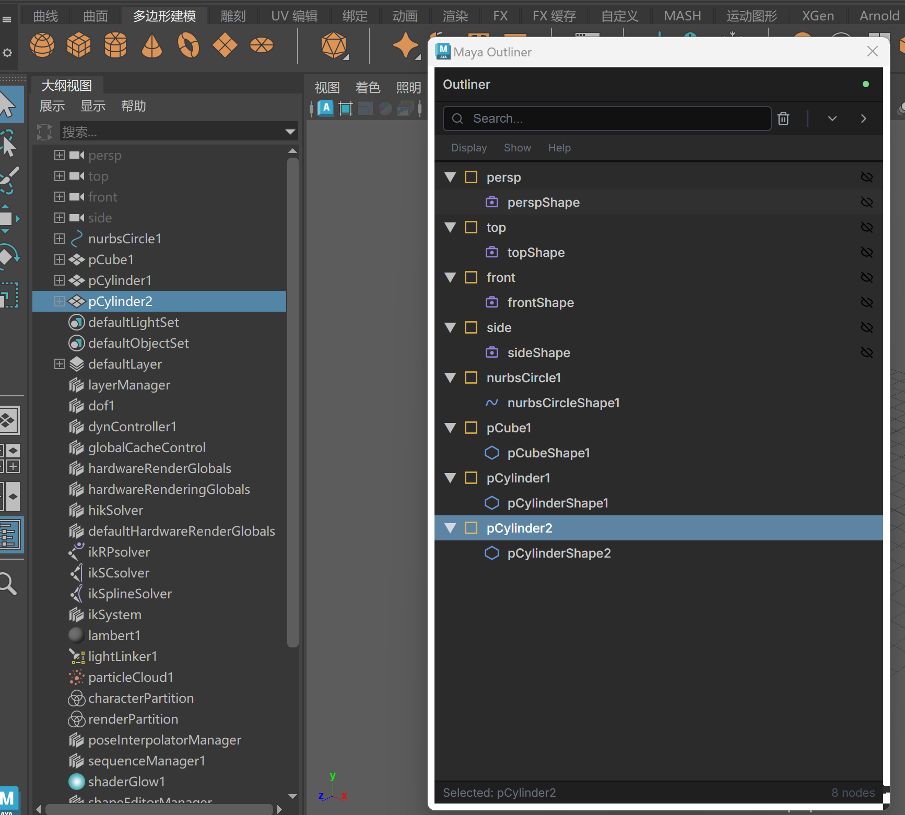

# AuroraView Maya Outliner

这是一个可以在 Maya 内运行的教学示例：Vue 展示场景树，Python 执行 Maya 命令，AuroraView 通过嵌入的 QtWebView 连接两端。它展示现代网页界面如何成为真正的 Maya 工具。

[English tutorial](README.md) · [AuroraView 主项目](https://github.com/try-auroraview/auroraview) · [组织官网](https://try-auroraview.github.io/) · [验证记录](docs/VALIDATION.md) · [来源与权利说明](docs/PROVENANCE.md)

本仓库就是主项目原来链接的 **Maya Outliner Example**，从 Long Hao 的个人仓库迁入组织并保留历史。它与 [Maya 宿主适配器](https://github.com/try-auroraview/auroraview-maya) 是两个不同项目。



*图片来自原项目；迁移后的验证范围见验证记录。*

## 学到什么

- 在 Maya 已有的 Qt 事件循环中嵌入 Vue 界面。
- 读取 DAG 层级，以完整路径区分不同父级下的同名对象。
- 网页选择对象、Maya 反向同步选择、多选和清空选择。
- 通过明确的 Python 方法修改可见性、重命名、复制、成组、删除和父子关系。
- 不开开发服务器加载生产前端，并在关闭时移除监听、释放 WebView。

## 环境要求

当前维护的教程路径是 **Windows x64、使用 Python 3 的 Maya、Maya 自带的 PySide，以及 WebView2 Runtime**。Maya 2022–2024 对应 PySide2，2025–2026 对应 PySide6。这些是代码适配路径，不代表每个版本都已完成交互验收，具体见[验证记录](docs/VALIDATION.md)。

使用 [vx](https://github.com/loonghao/vx) 管理 Node.js、uv 和 just。本示例将 `auroraview` 与 `qtpy` 安装到项目内目录，复用 Maya 自带的 Qt，不另装一套 PySide。

## 1. 构建前端

```powershell
vx git clone https://github.com/try-auroraview/auroraview-maya-outliner.git
cd auroraview-maya-outliner
vx just install
vx just build
```

构建包含 TypeScript 检查，并生成 `dist/index.html` 和静态资源。

## 2. 准备 Maya Python 运行依赖

按本机安装版本修改解释器路径：

```powershell
vx just maya-runtime "C:/Program Files/Autodesk/Maya2026/bin/mayapy.exe" ".maya-runtime"
```

依赖安装在本项目的 `.maya-runtime`，不修改 Maya 的 `userSetup.py`，也不替换 Maya 自带 PySide。更新原生 wheel 后重启 Maya。

## 3. 在 Maya 内启动

打开 Maya Script Editor，选择 **Python**，执行：

```python
import sys
from pathlib import Path

repo = Path(r"C:/path/to/auroraview-maya-outliner")
sys.path.insert(0, str(repo))
sys.path.insert(0, str(repo / ".maya-runtime"))

from auroraview_maya_outliner import main
outliner = main(use_local=True)
```

`use_local=True` 要求已构建前端，缺失时会明确报错。QtWebView 通过 AuroraView 静态资源协议加载文件，无需 HTTP 服务器。再次调用 `main()` 会显示已有窗口。

开发时另开终端执行 `vx just dev`，关闭已有 outliner 后使用 `main(url="http://127.0.0.1:5173")`，即可使用 Vite 热更新。

### 可选：原生停靠与共享重命名

固定的 **Windows x64 / Maya 2026** GUI 候选使用 AuroraView 0.5.12、QtPy 2.4.3
和 packaging 25.0，并验证发布者提供的哈希：

```powershell
vx just maya-gui-runtime "C:/Program Files/Autodesk/Maya2026/bin/mayapy.exe" ".maya-gui-runtime"
```

按[公开契约 wheel 的安装步骤](docs/SHARED_TOOLS.md)准备 `.maya-contract-runtime`。
更换原生依赖后使用新的 Maya 会话。像上文一样设置 `repo`，在导入 AuroraView 前加入两个运行目录：

```python
sys.path[:0] = [str(repo / ".maya-gui-runtime"), str(repo / ".maya-contract-runtime"), str(repo)]
from auroraview_maya_outliner import MayaOutliner
from auroraview_maya_outliner.tools import create_tools

outliner = MayaOutliner(dockable=True)
tools = create_tools(outliner.api)
outliner.run(use_local=True, tools=tools)
```

可选停靠使用 Maya 原生 `workspaceControl`。传入 `tools` 后，Vue 重命名动作与
`scene.rename` 共用同一份 schema、处理函数和场景读回。需要 Agent 调用时，将这份
ToolSet 单独附着到宿主已有的 Core 服务，由宿主提供主线程调度。关闭面板只释放 UI
绑定、回调和视图，保留 ToolSet 与借用的服务；工具所有者卸载时再调用 `tools.close()`。
默认入口仍使用原来的 Qt 对话框与页面路由。

`vx just maya-gui-imports <mayapy> <gui-target> <downloaded-native-wheel> <contract-target> <report>`
会核对隔离导入，并将安装文件与[固定原生 wheel](https://github.com/try-auroraview/auroraview/releases/download/auroraview-v0.5.12/auroraview-0.5.12-cp38-abi3-win_amd64.whl)
逐字节比较，不创建 GUI。真实页面像素、原生停靠、键鼠输入、Undo/事件和 DPI 行为仍需通过项目自有 DCC-CUA 实机验收。

## 4. 创建小场景并演示

下面只向当前场景添加对象，不会重置场景：

```python
import maya.cmds as cmds

root = cmds.group(empty=True, name="av_demo")
cube = cmds.polyCube(name="av_cube")[0]
sphere = cmds.polySphere(name="av_sphere")[0]
cmds.parent([cube, sphere], root)
cmds.select(cube)
```

在网页场景树点击立方体，确认 Maya 选择变化；在 Maya 选择球体，确认网页高亮变化。Ctrl 点击可多选，再次 Ctrl 点击最后一行可清空选择。点击眼睛切换可见性，双击名称重命名。在这个临时示例上尝试拖拽父子关系和右键菜单。

## 桥接的具体路径

```text
Vue -> auroraview.call("api.select_node", 参数)
    -> SceneAPI.select_node() -> Maya 主线程中的 maya.cmds

Maya SelectionChanged -> QtWebView.emit("selection_changed", 数据)
                      -> auroraview.on(...) -> Vue 状态
```

Python 通过 `webview.bind_api(scene_api)` 暴露显式方法。前端统一使用 Promise 调用和 AuroraView 事件订阅：

```typescript
const nodes = await window.auroraview.call('api.get_scene_hierarchy')
await window.auroraview.call('api.select_node', {
  node_name: '|av_demo|av_cube',
})
const unsubscribe = window.auroraview.on('selection_changed', payload => {
  // payload.nodes 是全部已选对象的完整 DAG 路径，清空时为 []。
})
// Vue 组件卸载时调用 unsubscribe()。
```

完整 DAG 路径是对象身份，短名称仅用于显示。对象缺失、名称歧义或 Maya 命令失败会使调用失败，不能当作成功。QtWebView 复用 Maya 的事件循环；场景回调通过 Qt 单次定时器合并刷新，不自行接管消息循环。

## 共享运行时的计划方向

AuroraView 专注现代 Web 界面、渲染与原生宿主停靠。计划中的薄集成将复用 DCC-MCP Core 现有的 Server/MCP、工具与 Skill 注册、宿主执行桥、线程调度和生命周期。DCC-MCP 保持这些职责，不转变为前端框架。

资源归属原则是优先附着宿主已有服务。面板关闭时只释放自己创建的订阅和任务，只有服务由面板拥有时才关闭服务。页面动作和显式注册的 Agent 工具应复用同一份宿主业务能力。

默认教程仍使用以 Maya 为父窗口的 Qt 对话框和自有场景回调。上面的显式选项提供原生停靠与借用的共享工具；自动发现宿主服务不在本示例范围内。已有 standalone 验证不证明 GUI/WebView 或原生停靠已通过交互验收。本示例不另造 Core API，也不会自动把界面方法暴露成 Agent 工具。

## 关闭与清理

```python
outliner.close()
assert not outliner._callbacks.ids
outliner = main(use_local=True)
```

点击窗口关闭按钮也执行同样的清理：停止刷新定时器、移除 Maya 回调、销毁 WebView、释放实例登记。清理失败时保留所有者和未释放资源，可再次调用 `outliner.close()` 重试。Vue composable 会在组件卸载时取消事件订阅。

## 测试和示例包

```powershell
vx just check
vx just maya-smoke "C:/Program Files/Autodesk/Maya2026/bin/mayapy.exe"
vx just package 0.1.0-test
```

`check` 在 Maya 外执行前端构建与场景/config/打包契约测试。`maya-smoke` 启动独立 mayapy 进程，验证真实 DAG、同名节点、单选/多选/清空、可见性和回调移除。它不证明 WebView 渲染或 Maya 内的交互演示已验收。

`dist/` 下的源码示例包包含已构建前端、前端源码、Python、recipes、测试、教程和来源记录。解压后，将其中的 `maya-outliner` 目录作为启动示例中的 `repo`；只有修改前端时才需要重新构建内含的 `dist/`。运行依赖仍使用包内的 `maya-runtime` recipe 按上面的步骤安装。旧安装器和开发脚本作为历史项目材料保留；本页描述的是当前维护的教程工作流。

## 排错

| 现象 | 处理 |
| --- | --- |
| 缺少 `dist/index.html` | 执行 `vx just install`、`vx just build`。 |
| 找不到 `auroraview` / `qtpy` | 用对应 Maya 的解释器执行 runtime recipe，并将 `.maya-runtime` 加入 `sys.path`。 |
| 找不到 Maya 主窗口 | 在交互版 Maya 完成启动后执行；mayapy 没有主窗口。 |
| 普通浏览器里有界面但没有场景 | 通过 Maya 启动函数打开；普通浏览器没有 Maya bridge。 |
| 对象缺失或名称歧义 | 刷新并使用完整 DAG 路径。 |
| 原生 wheel / WebView 初始化失败 | 检查 Maya Python ABI、Windows x64、WebView2 Runtime，并保留 Script Editor traceback。 |

原作者为 **Long Hao (loonghao)**。迁移保留的源码提交没有 LICENSE 文件；详见[来源与权利说明](docs/PROVENANCE.md)。AuroraView 主项目的 MIT 许可不会自动授予本独立示例。
